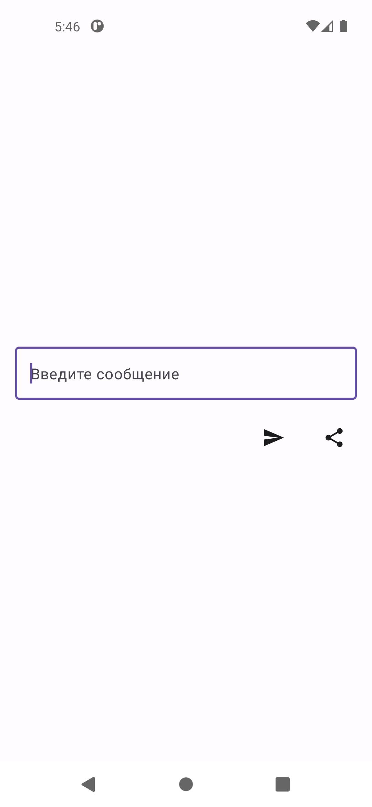
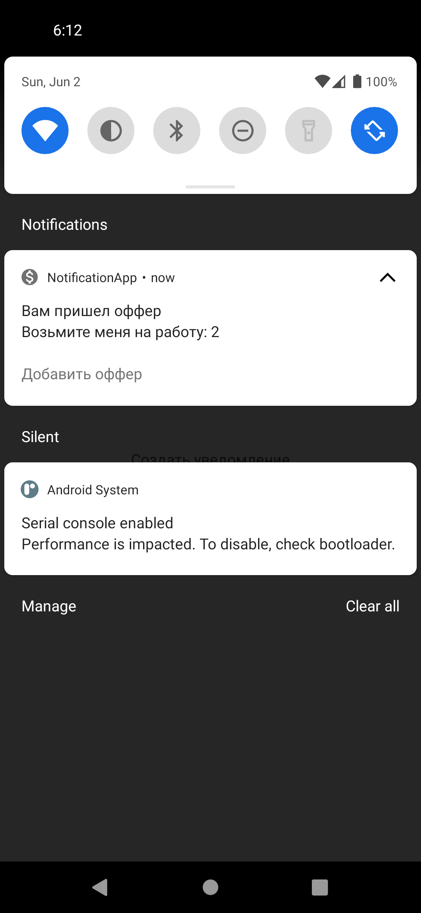

# Firebase Cloud Messaging

  
   
   

## NotificationService 

  
   

## Пример реализации NotificationService через приложение и Firebase Cloud Messaging 

- Проверка на разрешение для уведомлений

- Создание каналов уведомлений

- Реализация уведомлений по клику
  
- Реализация уведомлений через FCM

- Отправка уведомлений на конкретное устройство

- Отправка уведомлений всем кто подписан на опередленную группу FCM

- Каждая реализация в своей ветке git
